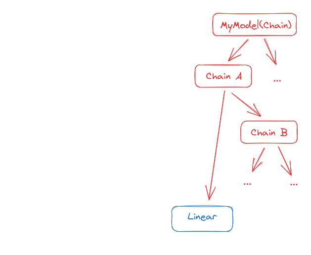
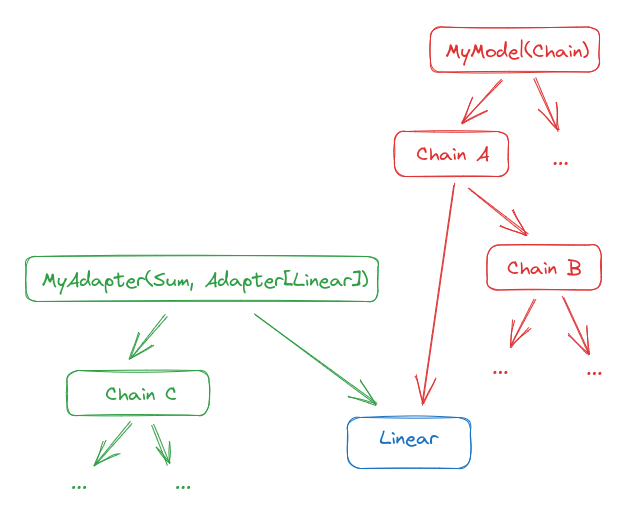
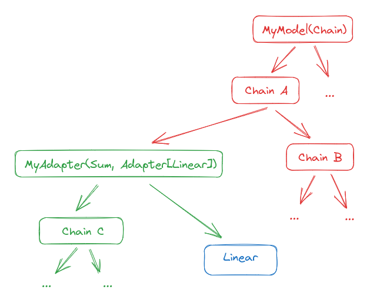
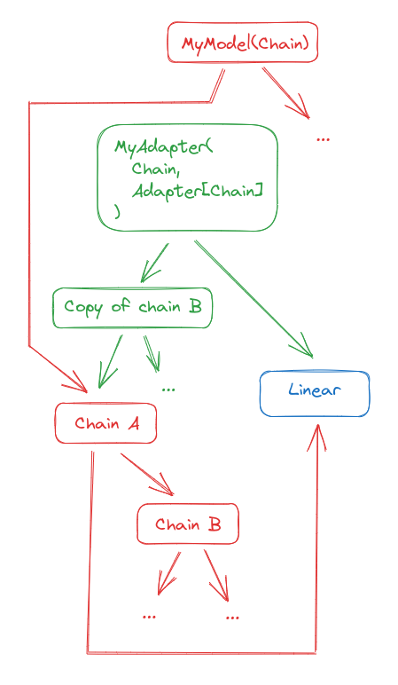
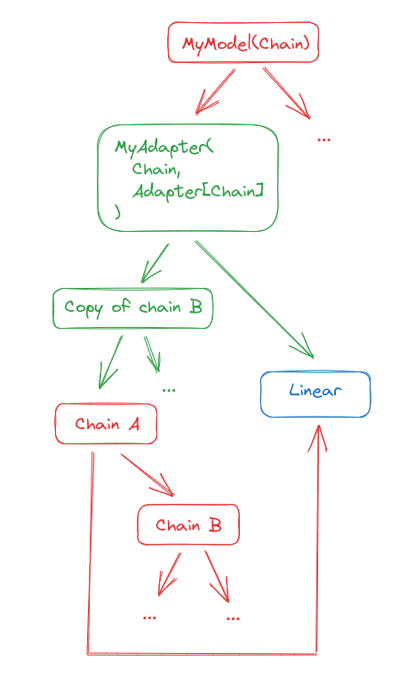

# What is an Adapter in Refiners? A technical overview

An Adapter is a Chain that replaces a Module (the target) in another Chain (the parent). Typically the target will become a child of the adapter.

In code terms, `Adapter` is a generic mixin. Adapters subclass `type(parent)` and `Adapter[type(target)]`. For instance, if you adapt a Conv2d in a Sum, the definition of the Adapter could look like:

```py
class MyAdapter(Sum, Adapter[Conv2d]):
    ...
```

## A simple example: adapting a Linear

Let us take a simple example to see how this works. Consider this model:



In pseudo-code, it could look like this:

```py
my_model = MyModel(Chain(Linear(), Chain(...)))
```

Suppose we want to adapt the Linear to sum its output with the result of another chain. We can define and initialize an adapter like this:

```py
class MyAdapter(Sum, Adapter[Linear]):
    def __init__(self, target: Linear) -> None:
        with self.setup_adapter(target):
            super().__init__(Chain(...), target)

# Find the target and its parent in the chain.
# For simplicity let us assume it is the only Linear.
for target, parent in my_model.walk(Linear):
    break

adapter = MyAdapter(target)
```

The result is now this:



Note that the original chain is unmodified. You can still run inference on it as if the adapter did not exist. To use the adapter, you must inject it into the chain:

```py
adapter.inject(parent)
```

The result will be:



Now if you run inference it will go through the Adapter. You can go back to the previous situation by calling `adapter.eject()`.

## A more complicated example: adapting a Chain

We are not limited to adapting base modules, we can also adapt Chains.

Starting from the same model as earlier, let us assume we want to:

- invert the order of the Linear and Chain B in Chain A ;
- replace the first child block of chain B with the original Chain A.

This Adapter that will perform a `structural_copy` of part of its target, which means it will duplicate all Chain nodes but keep pointers to the same `WeightedModule`s, and hence not use extra GPU memory.

```py
class MyAdapter(Chain, Adapter[Chain]):
    def __init__(self, target: Linear) -> None:
        with self.setup_adapter(target):
            new_b = Chain(target, target.Chain.Chain_2.structural_copy())
            super().__init__(new_b, target.Linear)

adapter = MyAdapter(my_model.Chain_1)  # Chain A in the diagram
```

We end up with this:



We can now inject it into the original graph. It is not even needed to pass the parent this time, since Chains know their parents.

```py
adapter.inject()
```

We obtain this:



Note that the Linear is in the Chain twice now, but that does not matter as long as you really want it to be the same Linear layer with the same weights.

As before, we can call eject the adapter to go back to the original model.

## A real-world example: LoraAdapter

A popular example of adaptation is [LoRA](https://arxiv.org/abs/2106.09685). You can check out [how we implement it in Refiners](../src/refiners/adapters/lora.py).
